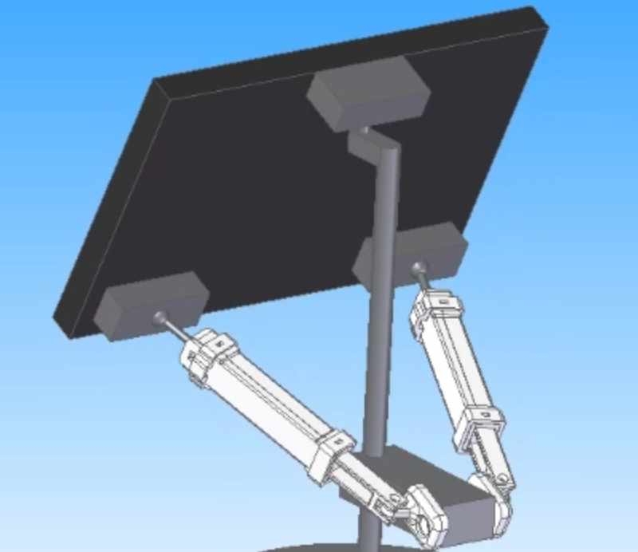
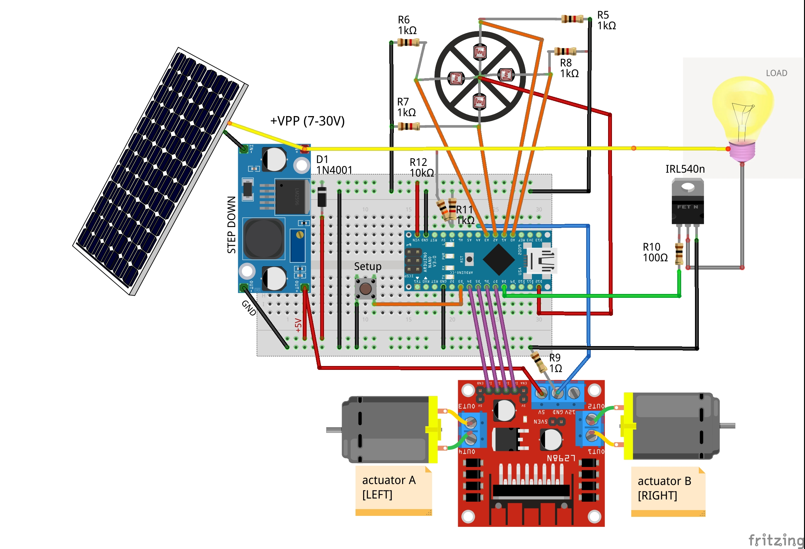
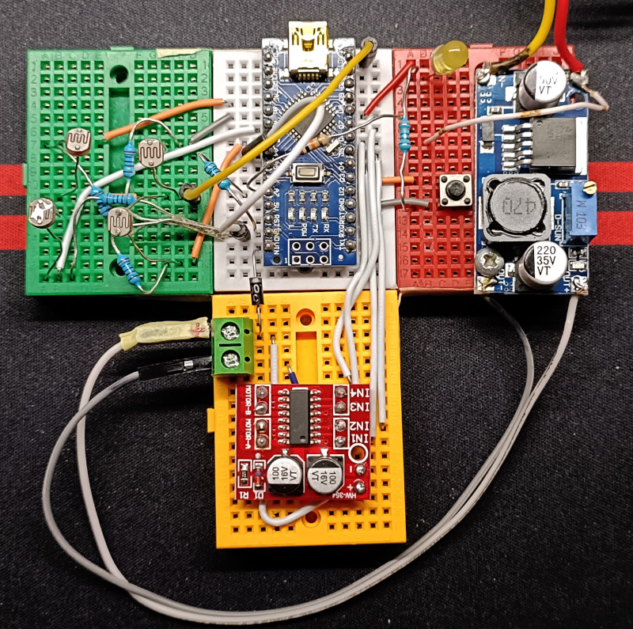

# mysoltrk - a solar tracker, reinvented

### A different approach for a solar tracker, alternative movements, to be installed on the outside, to recharge devices

**Code repository for project published on Hackday.io :** https://hackaday.io/project/190586-mysoltrk-a-solar-tracker-reinvented

    

We want to create a new, different version of solar tracker, to increase the yield of solar panels.

Our challenge is create a new device:

- small, suitable for balcony or small gardens
- solid, it must stand outdoors with any weather
- solid, with three support points instead of one
- 3D printed, sufficiently waterproof
- minimal hardware, low cost
- self-tracker device, without GPS or WIFI

We want to install this device outside the windows, balconies, small gardens where there is little space and we want the chance to charge smartphones, power banks or external cameras taking up less space and higher energy production

## Schematic

    

## Prototype

    

## Source code

- ActuatorMovements.ino

Code to test the L298N-mini driver and shunt resistor behavior

- SolarTrackerReinvented.ino

This is a working example of solar tracker based on mysoltrk hardware disposition

## NOTES

- Always use an external power supply when you test hardware without an attached panel
